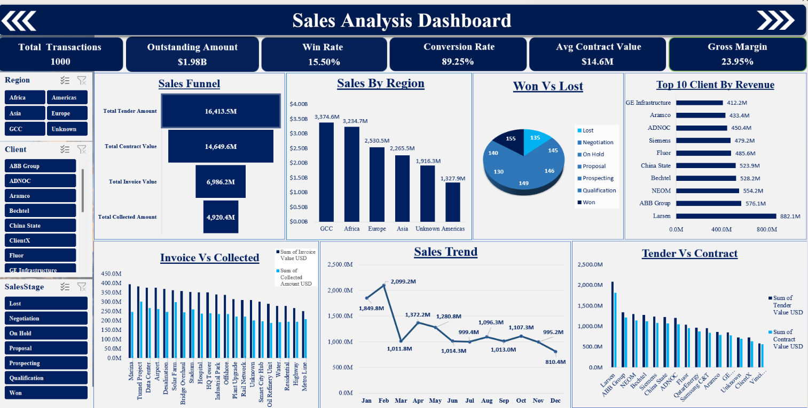
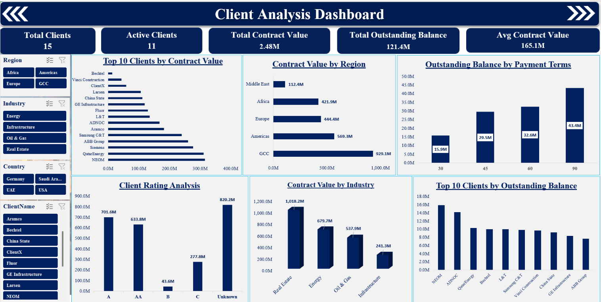
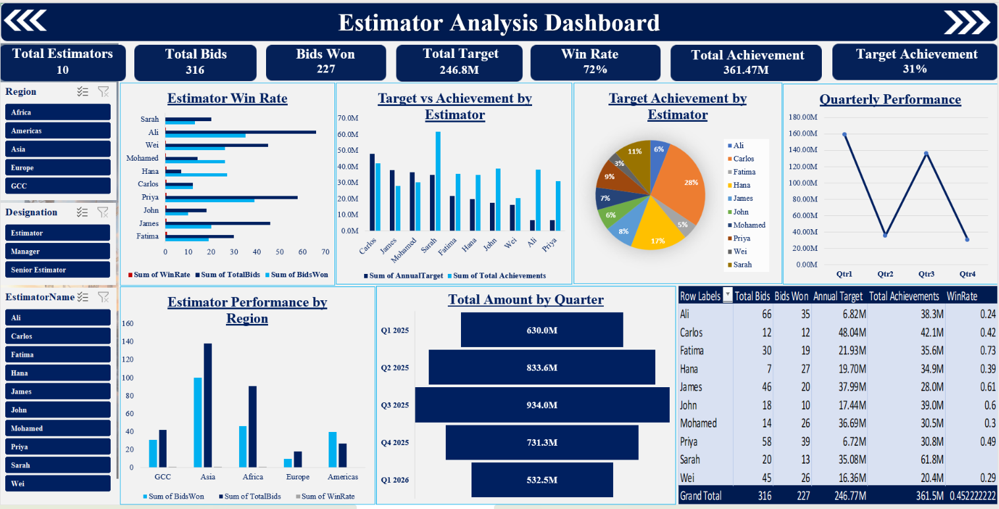

# Construction Sales & Project Performance Analysis

## About the Project

A data analytics project completed as part of my **Data GUC internship**, focused on analyzing construction sales and project performance data and transforming raw data into meaningful business insights.

## Tools Used

* Microsoft Excel
* Pivot Tables
* Data Cleaning & Preprocessing
* Exploratory Data Analysis
* Data Visualization
* Interactive Dashboards

## Project Areas

* 📊 Sales Analysis
* 🏗️ Projects & Costs Analysis
* 👥 Client Analysis
* 📈 Estimator Performance Analysis

## Dashboard Preview

### Sales Dashboard

### Project & Costs Dashboard

### Client Dashboard

### Estimator Performance Dashboard

## Key Skills Demonstrated

Data Cleaning | Data Analysis | KPI Analysis | Data Visualization | Dashboard Development | Business Intelligence

## Internship

**Data GUC — Data Analyst Intern**

## Author

**Shifana P.**

